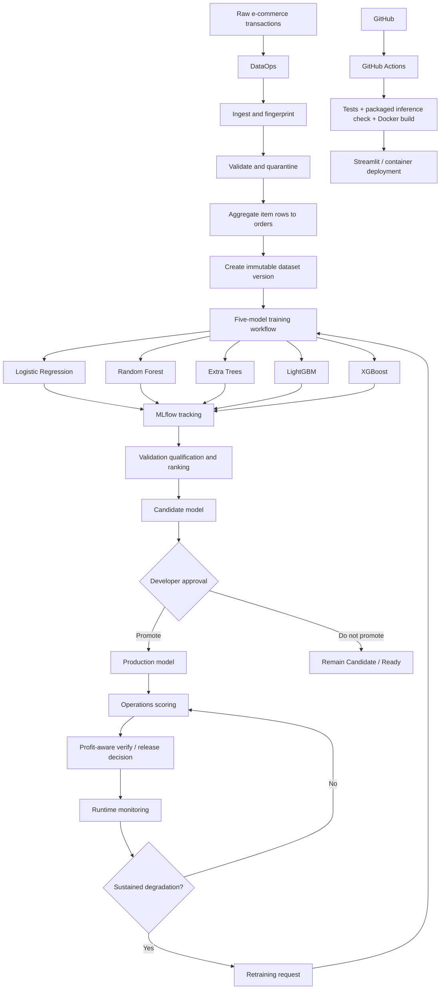

# Profit-Aware E-Commerce Order Cancellation Risk

**An end-to-end machine-learning system for deciding whether a newly placed e-commerce order should be released to fulfillment or briefly held for verification.**

This repository demonstrates a complete ML system across **DataOps, ModelOps, DevOps, deployment, monitoring, and retraining**. It is designed as a working application first: the app starts with a deployed model, scores orders immediately, tracks operational decisions, supports new-data ingestion, compares multiple model families, records experiments in MLflow, monitors production-like traffic, and can retrain models when new data or degradation signals justify it.

The project uses the public **Pakistan's Largest E-Commerce Dataset** and converts its item-level transactions into an order-level cancellation-risk problem.

---

## 1. What problem does this solve?

Late order cancellations can create avoidable costs after a retailer has already reserved inventory, processed payment activity, picked or packed items, or involved customer service. At the same time, verifying every order would create unnecessary delay and expense.

The system therefore asks two questions for each order:

1. **How likely is this order to be canceled?**
2. **Is verifying this order expected to save more money than the verification costs?**

The Production model estimates cancellation probability. A separate business-decision layer combines that probability with configurable operating assumptions to recommend either:

- **Release to Fulfillment**, or
- **Keep for Verification**.

### Starter model registry

The initial deployment includes five trained model families:

| Model | Initial registry status | Compute |
|---|---|---|
| Logistic Regression | Ready / baseline | CPU |
| Random Forest | Ready | CPU |
| Extra Trees | Ready | CPU |
| **LightGBM** | **Production** | CPU or GPU when available |
| XGBoost | Ready | CPU or GPU when available |

The application **does not retrain when it starts**. A packaged LightGBM model is loaded immediately for inference. New training produces model versions that are tracked and evaluated separately from Production.

---

## 2. Professor / reviewer quick tour

A short walkthrough of the implemented system can be done in this order:

1. **Landing page** → choose **Operations Manager** or **Developer**.
2. **Operations → Score Order** → score a manual order, batch CSV, or incoming-order demo.
3. Review the cancellation probability, economic recommendation, and manager action.
4. **Developer → DataOps** → inspect validation, quarantine, aggregation, lineage, and dataset versions.
5. **Developer → Experiments & MLflow** → compare the five models or manually tune one model and log a new experiment.
6. **Developer → Model Registry & Deployment** → inspect Ready, Candidate, and Production models; promote a reviewed Candidate.
7. **Developer → Model Monitoring** → inspect runtime health, drift, labeled performance, business impact, and retraining signals.
8. **Developer → System Status** → verify the packaged model, database, CI, Docker, and inference contract.

This sequence demonstrates the full lifecycle from data to deployment and monitoring without requiring model training before the first prediction.

---

## 3. System architecture



### Separation of responsibilities

- **DataOps** creates trustworthy, reproducible, versioned data products.
- **ModelOps** trains, evaluates, tracks, compares, versions, and promotes models.
- **Operations** uses only the current Production model to make order decisions.
- **Monitoring** observes production-like behavior and can request retraining.
- **DevOps** validates the repository through automated tests, Docker, and GitHub Actions.

---

## 4. Why machine learning is appropriate

Cancellation behavior can depend on interacting factors such as order value, quantity, category mix, discount, payment method, order timing, customer tenure, and prior customer behavior. Fixed rules are unlikely to represent these relationships consistently.

The task is formulated as supervised binary classification:

```text
Canceled = 1
Completed = 0
```

Only features available at or before order creation are permitted. Outcome-derived variables such as final order status, BI status, refund/completion information, and other post-order fields are excluded from the model feature contract to reduce target leakage.

---

## 5. Profit-aware decision logic

A probability alone does not create business value. The system converts cancellation risk into an expected economic decision.

For an order with predicted cancellation probability `p`:

```text
Expected money saved
= p × loss if a canceled order reaches fulfillment × loss prevented by verification

Expected net savings
= expected money saved
  - cost to verify the order
  - (1 - p) × extra cost of unnecessarily verifying a good order
```

The Operations UI uses plain-language assumptions:

- **Loss if a canceled order reaches fulfillment**
- **Loss prevented by verification (%)**
- **Cost to verify one order**
- **Extra cost if a good order is verified**

If expected net savings are positive, the economic policy recommends verification. The Operations Manager can still make the final operational decision.

### Currency handling

The original dataset and trained feature distributions remain in **PKR**. User-facing monetary values are displayed in **USD** using the latest available PKR→USD rate. The app converts manual USD inputs back to PKR before model inference, preserving the original model contract. A packaged fallback rate keeps the app usable during an exchange-rate service outage.

---

## 6. Operations workflow

The Operations workspace contains:

- **Operations Dashboard**
- **Score Order**
- **Decision History**

### Manual order

A new order can be entered directly in the UI:

```text
Customer order
    ↓
Production model scores cancellation risk
    ↓
Economic recommendation
    ↓
Awaiting Operations Review
    ├── Release to Fulfillment
    └── Keep for Verification
```

Manual orders are treated as production-like traffic and are eligible for runtime monitoring.

### Batch scoring

A one-row-per-order CSV can be scored in one operation. Each prediction is stored individually so batch traffic can contribute to monitoring and Business Impact. The scored file can be downloaded afterward.

### Incoming Order Demo

A packaged demo queue uses real historical examples selected across low-, medium-, and high-risk bands so the review workflow is useful during a presentation.

Demo traffic can optionally contribute to prototype Business Impact, but it is **always excluded from technical drift monitoring** so the intentionally balanced demo sampler cannot create false drift alerts.

---

## 7. DataOps pipeline

The source dataset is item-level, while the prediction unit is one order. DataOps is therefore a core part of the system rather than a simple CSV upload step.

The pipeline performs:

1. **File fingerprinting** for lineage and duplicate-batch protection
2. **Raw-source preservation**
3. **Schema and data-quality validation**
4. **Quarantine** of invalid or inconsistent records
5. **Order-level consistency checks**
6. **Deterministic item-to-order aggregation**
7. **Leakage-safe customer-history recomputation** across the cumulative timeline
8. **Immutable dataset version creation**
9. **Retraining-request creation** for a new dataset version

The packaged Pakistan baseline is already prepared, so the application can score orders immediately on first deployment. New data produces new immutable versions instead of silently replacing the baseline.

DataOps **never deploys a model directly**.

---

## 8. Evaluation design and leakage protection

Every formal five-model suite uses one deterministic temporal split for the selected dataset version:

```text
Earliest 70% of orders  → training
Next 15%                → validation
Latest 15%              → final test holdout
```

The split is chronological so evaluation better resembles scoring future orders.

### Important model-selection rule

The **validation split** is used for:

- threshold tuning
- qualification gates
- model comparison
- Candidate selection

The **final test split is not used to choose the model**. It is reserved for unbiased final reporting after selection.

All models in a suite share the same:

- dataset version and SHA-256 fingerprint
- temporal split ID and date ranges
- feature-schema version
- business assumptions
- reproducibility metadata

---

## 9. Model experimentation and MLflow

The project supports both automated and hands-on experimentation.

### Five-model retraining

A retraining run compares:

- Logistic Regression
- Random Forest
- Extra Trees
- LightGBM
- XGBoost

Each run is tracked in MLflow. LightGBM and XGBoost can prefer GPU execution when compatible hardware is available; Random Forest and Extra Trees use CPU implementations.

### Manual developer experiments

Developers can also open **Experiments & MLflow**, choose one model family, tune a focused set of hyperparameters, and run the experiment directly inside the application without opening Google Colab.

A manual run:

1. selects an immutable dataset version
2. selects the model family
3. selects full-data or optional deterministic quick-sample training
4. sets model-specific hyperparameters
5. records the random seed and device preference
6. trains and evaluates the model
7. logs parameters, metrics, artifacts, and environment information to MLflow
8. registers the trained model as **Ready**

A manual experiment does not replace Production automatically. The Developer may explicitly nominate it as Candidate later.

### Experiment naming

Example experiment:

```text
cancellation-risk__pakistan_seed_v1__20260930
```

Example run names:

```text
logistic_regression__20260930T180000Z
random_forest__20260930T180000Z
extra_trees__20260930T180000Z
lightgbm__20260930T180000Z
xgboost__20260930T180000Z
```

Manual tuning runs use names such as:

```text
random_forest__manual__20260930T203000Z_a1b2c3
```

### What MLflow records

Each formal run records, where applicable:

- dataset version
- SHA-256 dataset fingerprint
- split ID and split date ranges
- feature-schema version
- model family
- training timestamp
- random seed
- training scope
- train / validation / test sizes and class prevalence
- hyperparameters
- CPU/GPU device
- ROC-AUC
- PR-AUC
- Brier score
- F1, precision, and recall
- recall at fixed precision
- validation business value
- final-test business value
- qualification-gate settings
- Git commit SHA
- Python and library versions
- fitted model artifact

---

## 10. Fair five-model benchmark

A report-ready benchmark is packaged under:

```text
artifacts/final_benchmark/benchmark_summary.json
artifacts/final_benchmark/benchmark_comparison.csv
```

All five models are trained on the **same complete 318,135-order dataset** using the same temporal split, feature schema, random-seed policy, and business assumptions.

### Final temporal test results

| Model | Qualified on validation? | Test ROC-AUC | Test PR-AUC | Test Brier | Recall @ 90% precision |
|---|---:|---:|---:|---:|---:|
| Logistic Regression | No | 0.869 | 0.965 | 0.138 | 98.25% |
| Random Forest | Yes | 0.907 | 0.975 | **0.084** | 98.80% |
| Extra Trees | Yes | 0.893 | 0.970 | 0.096 | 98.49% |
| **LightGBM** | Yes | **0.911** | **0.976** | 0.092 | **98.87%** |
| XGBoost | Yes | 0.906 | 0.975 | 0.094 | **98.87%** |

The validation-only model-selection procedure selected **XGBoost** as the Candidate in the packaged benchmark. The initial LightGBM artifact remains Production until a Developer explicitly promotes another Candidate. This demonstrates that experiment results and deployment state are separate concerns.

The benchmark can be rerun with:

```bash
python scripts/run_final_benchmark.py
```

When MLflow is installed:

```bash
python scripts/run_final_benchmark.py --track-mlflow
```

---

## 11. Candidate selection and deployment

The registry uses simple lifecycle states:

- **Ready** — trained model available for review
- **Candidate** — proposed replacement for Production
- **Production** — model currently used for operational scoring

A model does not become Candidate solely because it has the highest ROC-AUC. It must first pass qualification gates covering:

- discrimination
- probability calibration
- recall at high precision
- positive estimated business value

Qualified models are compared using validation evidence. The final test set is reviewed afterward as unbiased evidence.

### Deployment governance

Training and Candidate selection can be automated. Deployment is intentionally human-controlled:

```text
Candidate
   ↓
Developer reviews technical + business evidence
   ↓
Approval checkbox
   ↓
Promote Candidate to Production
```

Production is never silently replaced by a newly trained model.

---

## 12. Monitoring and retraining

The monitoring page separates **runtime health**, **drift**, **observed model performance**, and **business impact**.

### Production-monitoring population

Included:

- manual order scoring
- batch scoring
- future API/production scoring

Excluded from technical drift:

- live demo simulation
- historical evaluation

A minimum eligible runtime sample is required before the system is allowed to label drift status.

### Runtime health

The system can track:

- prediction volume
- mean predicted cancellation risk
- inference latency
- mean / P95 / maximum latency
- pipeline success and failure counts
- verification rate

### Drift

The system monitors:

- prediction distribution shift
- numeric feature drift
- categorical feature drift

Population Stability Index (PSI) is used for distribution comparisons. Drift acts as an early-warning signal and does not automatically mean the model is inaccurate.

### Observed performance

When actual outcomes become available, a Developer can upload labeled outcomes such as:

```text
order_id,final_outcome
100001,Completed
100002,Canceled
```

The system can then calculate observed runtime metrics including ROC-AUC, Brier score, and high-precision recall.

### Retraining settings

Automatic retraining can be enabled or disabled from the Developer workspace. Developers can also choose the standard full-dataset workload or an optional deterministic quick-sample workload for diagnostics and demonstrations.

### Retraining triggers

Retraining is deliberately conservative. A request can be created by:

- a new immutable dataset version
- sustained severe prediction or feature drift
- confirmed ROC-AUC degradation
- confirmed Brier-score deterioration
- non-positive observed business value

A small or noisy batch is not enough to force retraining.

When automatic retraining is enabled, the application runs the five-model training workflow directly, tracks the models in MLflow, and registers the best qualified model as Candidate. **Production still requires Developer approval.**

Developers can also run retraining manually at any time.

---

## 13. Business Impact

Live Business Impact is separated from historical model evaluation.

### Operations Business Impact

Uses production-like Operations scoring and reports values such as:

- orders scored
- orders kept for verification
- expected cancellations reached
- expected cost prevented
- verification cost
- expected cost of unnecessary checks
- expected net savings
- expected net savings per 1,000 orders

Repeated scoring of the same order is deduplicated so the same order is not counted multiple times.

### Historical Business Backtest

The final labeled holdout is used separately to estimate what the economic policy would have done historically. This keeps retrospective evaluation from being presented as live operational savings.

---

## 14. Reproducibility

A model result should be traceable to its data, code, split, and configuration. Formal runs therefore record:

- immutable dataset version
- SHA-256 dataset fingerprint
- deterministic temporal split
- train / validation / test date ranges
- feature-schema version
- random seed
- model family and hyperparameters
- experiment and run names
- training device
- Git commit SHA
- Python and package versions
- technical metrics
- business metrics
- qualification gates
- serialized model artifact

The benchmark also stores an explicit reproducibility contract confirming that the five models were evaluated under the same experimental conditions.

---

## 15. DevOps and deployment

### First deployment behavior

The repository already contains the Production model and processed reference artifacts. Deployment therefore follows:

```text
Deploy repository
    ↓
Load packaged Production model
    ↓
Run inference immediately
```

No model training is required at startup.

### GitHub Actions

The repository contains:

```text
.github/workflows/ci.yml
```

CI performs automated checks such as:

- dependency installation
- regression tests
- packaged Production-model inference verification
- repository consistency checks
- Docker build validation

A visible backup workflow is also provided as `GITHUB_ACTIONS_CI.yml` in case a file-copy process omits hidden `.github` directories.

### Docker

Build and run locally:

```bash
docker build -t cancellation-risk-app .
docker run --rm -p 8501:8501 cancellation-risk-app
```

### Streamlit deployment

The current application is designed to run directly from the GitHub repository on Streamlit Community Cloud or in a Docker-compatible environment.

For a larger production deployment, the same separation of data pipeline, model artifacts, registry state, monitoring, and inference could be moved to durable cloud storage, a job scheduler, an API service, and managed authentication without changing the core model lifecycle.

---

## 16. Optional accelerated training with Google Colab

The primary application does **not** depend on Google Colab. Developers can train and tune models directly in the app.

An optional notebook is included at:

```text
notebooks/end_to_end_ml_workflow.ipynb
```

It can be used when separate compute or a Tesla T4 is useful. LightGBM and XGBoost can benefit from compatible GPU configurations, while scikit-learn Random Forest and Extra Trees remain CPU-based.


---

## 17. How this repository demonstrates DataOps, ModelOps, and DevOps

| System area | Implemented evidence |
|---|---|
| **DataOps** | ingestion, validation, quarantine, deterministic aggregation, leakage controls, lineage, immutable dataset versions |
| **Model experimentation** | five model families, manual hyperparameter tuning, full-data benchmark |
| **Experiment tracking** | MLflow parameters, metrics, artifacts, environment, run names |
| **Model versioning** | Ready / Candidate / Production registry lifecycle |
| **Deployment** | packaged Production artifact, explicit promotion, Streamlit, Docker |
| **Monitoring** | latency, prediction volume, drift, feature drift, labeled performance, business impact |
| **Retraining** | new-data and degradation requests, automatic or manual five-model retraining |
| **Reproducibility** | dataset fingerprint, split ID, seed, Git SHA, environment, model artifact |
| **CI/CD** | GitHub Actions, automated tests, inference check, Docker build |

---

